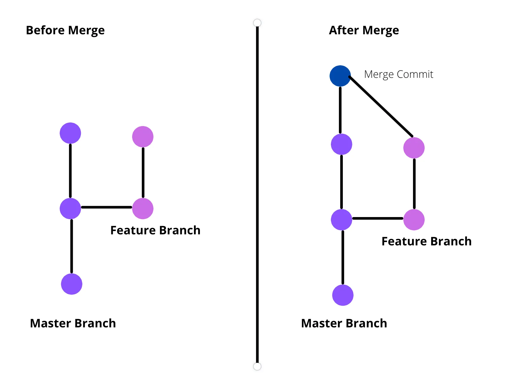

# Welcome to the  **Website Rebuild** repository
This README explains the preffered way to work with Git using VSCode and Google Drive.

---

## Table of Contents
- [Project Overview](#project-overview)
- [Workflow](#workflow)
  - [Open an Issue & Create a Branch](#1-open-an-issue--create-a-branch)
  - [Fetch Updates via GitHub Desktop](#2-fetch-updates-via-github-desktop)
  - [Work Locally in VSCode](#3-work-locally-in-vscode)
  - [Push Changes & Create a Pull Request](#4-push-changes--create-a-pull-request)
- [Key Concepts & Terminology for Git](#key-concepts--terminology-for-git)
  - [Repository (Repo)](#repository-repo)
  - [Branch](#branch)
  - [Commit](#commit)
  - [Push](#push)
  - [Fetch](#fetch)
  - [Pull](#pull)
  - [Sync (in VSCode)](#sync-in-vscode)
  - [Merge](#merge)
  - [Pull Request (PR)](#pull-request-pr)
  - [GitHub Desktop Workflow](#github-desktop-workflow)
- [Working with VSCode](#working-with-vscode)
- [GitHub Website Connection](#github-pages-connection)
- [Project Board](#project-board)
- [Best Practices](#best-practices)

---

## Project Overview

This repository (accessible at []) is a rebuild of the website []. It uses **PHP**, **HTML**, **CSS**, **JS**, and various **assets** (like images, fonts, etc.) to build the website.

**Setup:**
- **[Main Branch]():** This is the final, most up-to-date version.
- **[Website Branch]():** This is the production branch connected to the live website via GitHub Pages.
- **Local Work Environment:** All development is done locally using VSCode, with your working files synced via Google Drive.
- **Version Control:** All code changes are managed using Git and GitHub.

---

## Workflow

Our workflow ensures that all changes are tracked properly and that we don’t accidentally affect the live website. Follow these steps carefully:

### 1. **Open an Issue & Create a Branch**
   - Start by navigating to the [GitHub Project Board]().
   - Find the relevant issue or create a new one.
   - Create a branch from the **"Development"** field within the issue, and change its status.
   - **Naming convention:** Use the issue number and a brief description (e.g., `issue-5-fix-navbar`).

### 2. **Fetch Updates via GitHub Desktop**
   - Before starting any work, open **GitHub Desktop**.
   - Click **Fetch Origin** to ensure your local repository is up-to-date with the remote changes.
   - Use the GitHub Desktop GUI to select the branch you just created.
   - Once confirmed, open **VSCode** directly from GitHub Desktop. This ensures you are editing locally on your Google Drive–synced folder.

### 3. **Work Locally in VSCode**
   - In VSCode, verify that you are on the correct branch from the source control screen.
   - Make your changes in PHP, HTML, CSS, JS, or asset files.
   - Save your work frequently.
   - You can use "Live Server" to preview your modified site
   - Commit your changes with clear commit messages using VSCode's built-in source control system.
   - After committing, click the **Sync** button in VSCode to push your commits and pull any remote changes.

### 4. **Push Changes & Create a Pull Request**
   - Once your changes are committed and synced, push your branch to GitHub:
     - In VSCode, use the **Sync** button.
     - In GitHub Desktop, click **Push Origin** if necessary.
   - Open your repository on GitHub in your web browser.
   - Click "Compare & pull request" for your branch.
   - Provide a detailed description of your changes and submit the pull request.
     - Make sure to include a keyword such as Resolve and the # of the issue you are working on
     - i.e. `Resolves #5`
     - More information [here](https://docs.github.com/en/issues/tracking-your-work-with-issues/using-issues/linking-a-pull-request-to-an-issue)
   - Wait for review and approval before merging into the `main` branch.

---

## Key Concepts & Terminology for Git

When working with Git and GitHub, you will encounter several key concepts. Understanding these terms will help you follow the workflow efficiently.

### Repository (Repo)
A repository is a version-controlled directory containing all project files and their history. The repository for this project is hosted on GitHub and also stored locally on Google Drive for development.

### Branch
A branch is an independent line of development within the repository.
- The `main` branch represents the most up-to-date version of the website.
- The `website` branch represents the deployed (public) version of the website
- Feature development and fixes are done on separate branches before merging into `main`.
- Each branch is typically associated with an issue and follows a naming convention like `issue-#-description`. 

### Commit
A commit is a recorded change in the repository. It acts as a snapshot of the project at a given point in time.
- Each commit includes a message describing the changes made.

### Push
Push uploads your local commits to the remote repository on GitHub.
- It updates the remote branch with the latest changes from your local branch.

### Fetch
Fetch retrieves the latest changes from the remote repository without modifying your local files.
- It is useful for checking for updates before applying them.

### Pull
Pull fetches and merges remote changes into your current branch.
- It ensures that your local branch is synchronized with the remote repository.

### Sync (in VSCode)
The Sync button in VSCode is a shortcut that performs both a pull and a push, ensuring the local and remote repositories remain synchronized.

### Merge
Merging integrates changes from one branch into another. Typically, a pull request (PR) is created to review and merge feature branches into `main`.

### Pull Request (PR)
A pull request is a request to merge changes from a feature branch into another branch (usually `main`).
- It allows for code review and approval before integration.

### GitHub Desktop Workflow
- **Fetch Origin**: Checks for remote updates before making changes.
- **Switch Branches**: Ensures you are working on the correct branch.
- **Commit Changes**: Saves modifications locally with a commit message.
- **Push Origin**: Uploads committed changes to GitHub.
- **Create a Pull Request**: Requests to merge your changes into `main`.

Understanding and following these concepts will help maintain an organized workflow and prevent conflicts when collaborating on the project.

---

## Working with VSCode

VSCode is our Integrated Development Environment (IDE) that helps manage and edit code efficiently. Here’s how to work with VSCode:
  
- **Using Git in VSCode:**
  - VSCode has built-in Git support. You can view changes, commit, and push directly from the Source Control panel.
  - Always check the current branch name in the source control GUI.
  
- **Editing Files:**
  - Make your changes in PHP, HTML, CSS, JS, or any asset file.
  - Save your changes frequently.
  
- **Committing Changes:**
  - Provide clear commit messages (e.g., "Fix responsive navbar layout for mobile devices").
  - Stage your changes, commit, and then push them to the branch you are working on.

---

## GitHub Pages Connection

- The **website branch** is automatically connected to GitHub Pages, meaning any changes merged into `website` will update the live website.
- **Never edit the main branch or website branch directly.** All changes must go through a branch and a pull request to ensure that only reviewed and tested code is deployed.

  
<strong>Updating the Live Website from <code>main</code></strong> (Click to expand)

##### The website is deployed from the `website` branch, while the `main` branch contains the most up-to-date version of the project. To update the live website, follow these steps to merge the latest changes from `main` into `website`.

## Step 1: Ensure `main` is Up to Date
Before updating the website, make sure you are working with the latest version of `main`.

1. **Open GitHub Desktop.**
2. **Switch to the `main` branch** using the branch dropdown in the top left.
3. **Click "Fetch Origin"** to check for updates.
4. If there are updates, **click "Pull"** to sync your local copy with the remote repository.

## Step 2: Switch to the `website` Branch
1. In GitHub Desktop, **switch to the `website` branch** using the branch dropdown.
2. Click **"Fetch Origin"** again to ensure the `website` branch is up to date.

## Step 3: Merge `main` into `website`
1. With `website` selected, go to **Branch > Merge into Current Branch** in the GitHub Desktop menu.
2. Select `main` as the branch to merge from.
3. Click **Merge**.
4. If there are merge conflicts, GitHub Desktop will notify you. Resolve them in VSCode before continuing.

## Step 4: Push the Updated `website` Branch
1. Once merged, click **"Push Origin"** in GitHub Desktop.
2. This will update the `website` branch on GitHub, making the changes live.

## Step 5: Verify the Update
1. Open the website and check that the changes appear as expected.
2. If there are issues, double-check that all changes from `main` were merged and pushed correctly.

Following this workflow ensures that the website remains in sync with the latest stable version while allowing development to continue on `main`.

---

## Project Board

We use a project board to track all issues and tasks. Access the board here:
- [Project Board]()

The board helps you:
- See all open and closed issues.
- Link your branch and pull requests to specific issues!
- Discuss ideas in comments (Issues are presented like a forum thread)

---

## Best Practices

- **Always Check Your Branch:** Before editing, verify that you're on your feature branch and not on `main`.
- **Commit Often:** Frequent commits with descriptive messages help track changes and facilitate easier reviews.
- **Review Before Merging:** Use pull requests to get feedback from team members.
- **Stay Organized:** Keep issues, branches, and commits related to the specific tasks.
- **Sync Regularly:** Make sure your local repository is up-to-date with the remote changes to avoid conflicts.

---

For any questions, refer back to this README or reach out to your local Ido Somekh.
